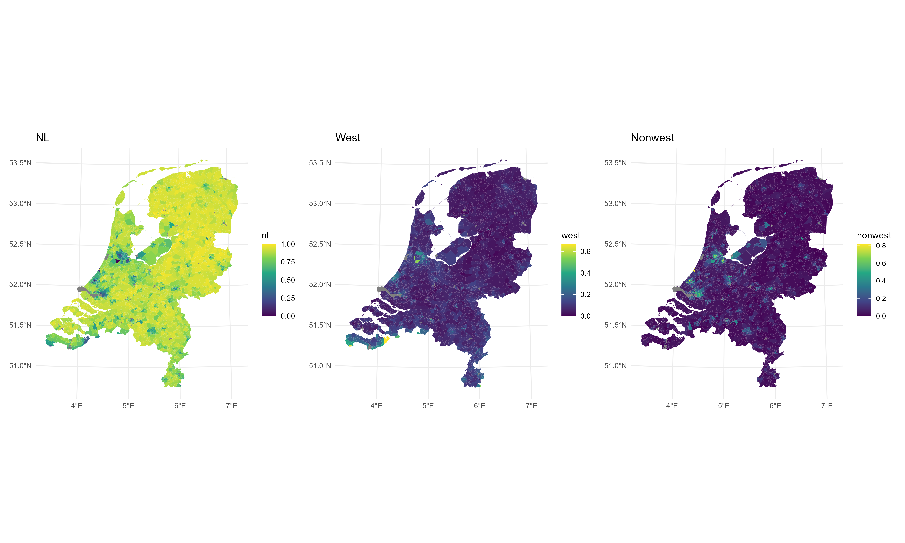

# OSSC workshop

This repository contains the code and presentation of the workshop on parallel computing & cluster computing using R in collaboration with SURF.

## Contact

This project is developed and maintained by the [ODISSEI Social Data
Science (SoDa)](https://odissei-data.nl/nl/soda/) team.

Do you have questions, suggestions, or remarks? File an issue in the
issue tracker or feel free to contact [Erik-Jan van
Kesteren](https://github.com/vankesteren)
([@ejvankesteren](https://twitter.com/ejvankesteren))
