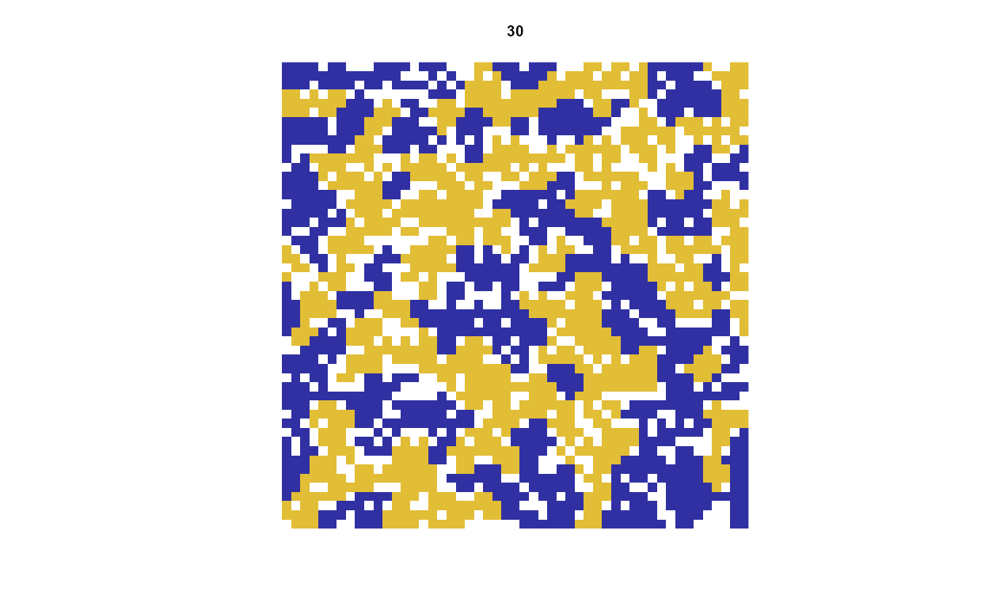

# OSSC workshop

This repository contains the code and presentation of the workshop on parallel computing & cluster computing using R in collaboration with SURF.

## Outline
-	Introduction to agent-based model
-	It’s slow, what can we do? 
    - Make faster through more efficient programming (I show this), makes it 8x faster
    - Leveraging “embarrassingly parallel”: parallel computing in R, makes it ~ncores times faster
-	But now it’s still too slow. That’s where supercomputer comes in.
    - Creating a condition grid
    - Rewriting script as self-contained program with chunking for supercomputer
    - Leveraging array job command in SLURM: 
    - Combining results & plotting
- End result: an approximately 77 x 16 x 8 = 9856 times speedup!

## Contact

This project is developed and maintained by the [ODISSEI Social Data
Science (SoDa)](https://odissei-data.nl/nl/soda/) team.

Do you have questions, suggestions, or remarks? File an issue in the
issue tracker or feel free to contact [Erik-Jan van
Kesteren](https://github.com/vankesteren)
([@ejvankesteren](https://twitter.com/ejvankesteren))
